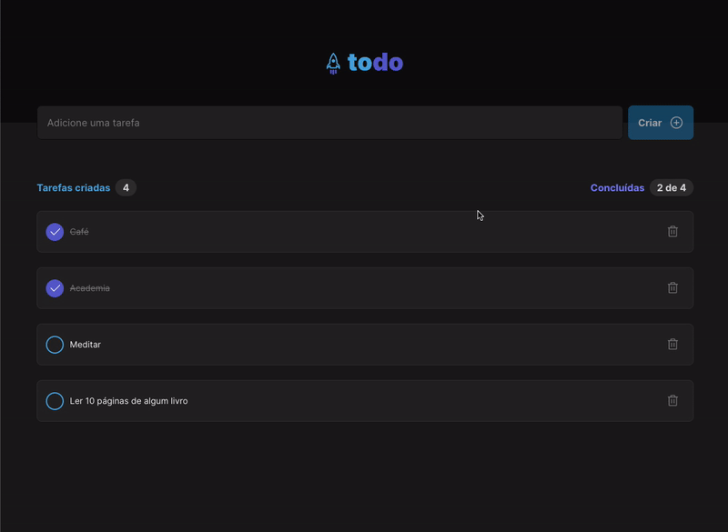

<p align="center">
  
</p>

<p align="center">
    <strong>Todo list</strong>
</p>

<p align="center">
  
  
  
  
</p>

<p align="center">
 <a href="#-sobre-o-projeto">Sobre</a> •
 <a href="#-layout">Layout</a> •
 <a href="#-tecnologias-utilizadas">Tecnologias</a> •
 <a href="#-instalação-e-uso">Instalação</a> •
 <a href="#-licença">Licença</a>
</p>

## 💻 Sobre o projeto

Todo App foi criado para resolução do desafio do curso Ignite (2022) da Rocketseat.

## 🎨 Layout
<p align="center">
  
</p>


## 🔨 Tecnologias utilizadas:

- **[ReactJS](https://reactjs.org/)**
- **[TypeScript](https://www.typescriptlang.org/)**
- **[Styled Components](https://styled-components.com/)**
- **[Vite](https://vitejs.dev/)**


## 🚀 Instalação e uso:

```bash
# Clone o repositório
git clone https://github.com/lucasjsr2/ignite-2022-todolist-challenge1.git

# Acesse o projeto
cd ignite-todo-app

# Instale as dependências
npm install

# Execute a aplicação
npm run dev
```


## 📝 Licença

<a href="https://opensource.org/licenses/MIT">
    
</a>

Esse projeto está sob a licença MIT. Veja o arquivo [LICENSE](./LICENSE.md) para mais detalhes.

---
